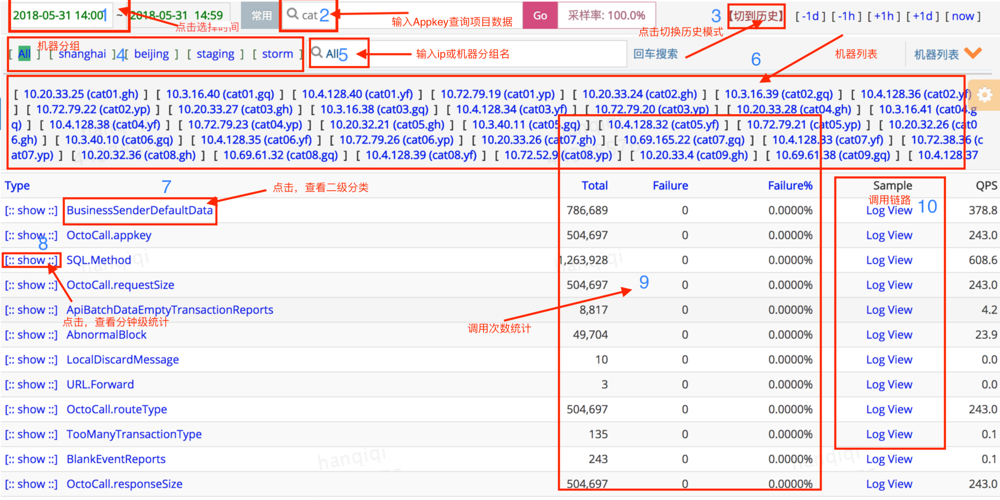
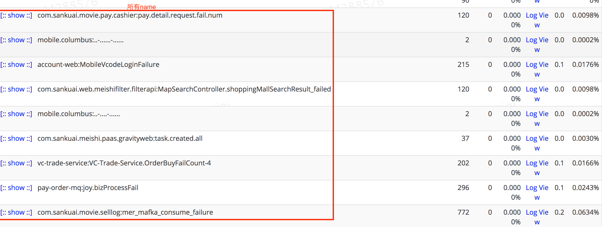
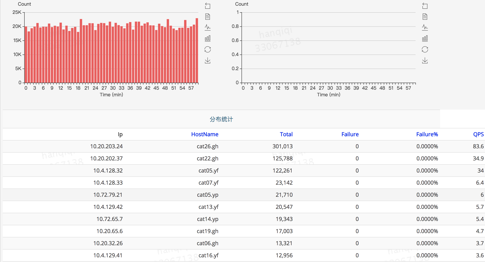
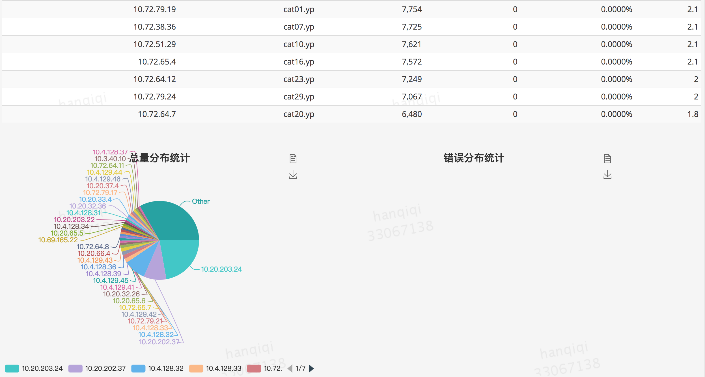
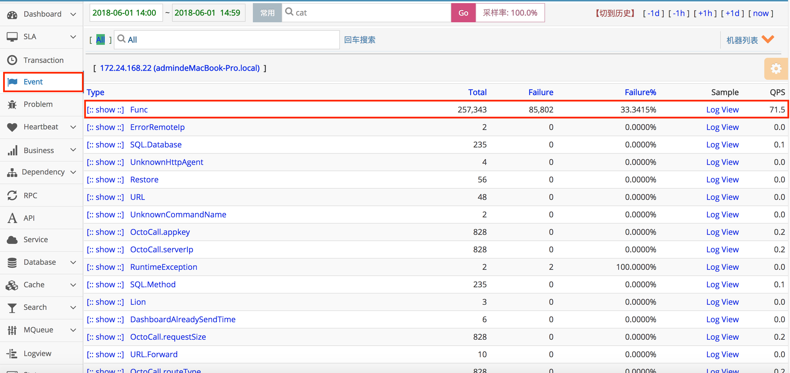
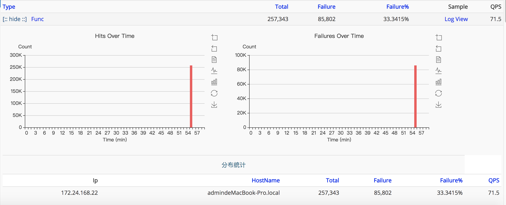
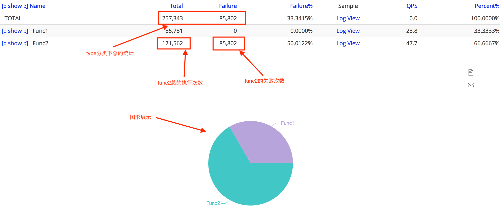

## Event报表
### 主要功能

监控一段代码运行次数：`例如记录程序中一个事件记录了多少次，错误了多少次`。Event报表的整体结构与Transaction报表几乎一样，只缺少响应时间的统计。

应用启动后默认会打点的部分:

|  打点 | 来源组件 | 描述 |
| --- | --- | --- |
| System | cat | 上报监控数据的打点信息 |

### 报表介绍 
#### 第一级分类（Type）统计界面

Type统计界面展示了一个Event的第一层分类的视图，Event相对于Transaction少了运行时间统计。可以知道这段时间里面一个分类运行的次数，失败次数，失败率，采样logView，QPS。

#### 第二级分类（Name）统计界面
第二级分类在Type统计界面中点击具体的Type进入，展示的是相同type下所有的name数据，可以理解为某type下更细化的分类。

#### Type统计界面详细介绍



从上而下分析报表：

1. 点击选择时间：小时报表，默认是以一小时为统计时间跨度；点击可以进行不同时间快速选择，例如要看2018-05-27 18:00 ~ 2018-05-27 18:59数据，点击选择2018-05-27 18:00即可。
2. 输入项目名，查看项目数据：页面会默认打开上次查看的项目名数据，如果需要切换其他项目数据，输入项目名，回车即可。
3. 点击切换到历史模式：默认页面是小时模式，与之对应的右侧快速导航，分别对应-1d -1h +1h +1d now，这四种都是切换到不同时间的小时报表；切换为历史模式后，右侧快速导航，变为month(月报表)、week(周报表)、day(天报表)，可以点击进行查看，注意时间跨度会有所不同。  
4. 机器分组：cat可以将若干个机器，作为一个分组进行数据统计。默认会有一个All分组，代表所有机器的统计数据，即集群统计数据。
5. 输入ip或分组名查看：当需要查看某台机器或某个分组数据时，可以快速进行搜索；可以看所有机器的总数据，也可以看单个机器，如果某台机器出现问题可以很容易定位。
6. 机器列表：展示了当前小时所有上报了监控数据的机器列表
7. 第一层分类（Type），点击查看第二级分类（称为<font color=#FF4500>name</font>）数据：
    - Event的埋点的Type和Name由业务自己定义，当打点了Cat.newEvent(type, name)时，第一层分类是type，第二级分类是name。
    - 第二级分类数据叫是统计相同type下的所有name数据，如下图，数据均与第一级（type）一样的展示风格：
    

8. 点击show，查看Type所有name分钟级统计，如下图:




9. 显示的是小时粒度第一级分类（type）的次数、错误数、失败率等数据
10. sample中是采样的调用链路对应的MessageTree信息

### 示例说明
#### 想记录在某个方法中一个条件分支中分支1中的函数调用了多少次，分支2中的函数调用了多少次，又失败了多少次。
以下是代码示例

```java
	public void testEvent() {
		for (int i = 0; i < 100; i++) {
			Transaction t = Cat.newTransaction("Trans", "test");

			for (int j = 0; j < 6000; j++) {
				if (j % 3 == 0) {
					func1();
					Cat.logEvent("Func", "Func1");
				} else {
					boolean result = func2();
					Event e = Cat.newEvent("Func", "Func2");
					if (result) {
						e.setSuccessStatus();
					} else {
						e.setStatus("False");
					}
					e.complete();

				}
			}

			t.setStatus(Transaction.SUCCESS);
			t.complete();
		}
	}

	private void func1() {

	}

	private boolean func2() {
		Random random = new Random();
		int res = random.nextInt(100);
		if (res % 2 == 0)
			return false;
		return true;
	}
```
#### 统计数据查看
1. 打开报表（[cat](http://cat.sankuai.com/cat/r/t?domain=cat)）如下图，查看Func下所有接口整体数据，小时粒度统计

点击show，查看Type所有name分钟级统计

  
   - 这是一个小时粒度统计报表，时间周期为2018-06-1 14:00 ~ 2018-06-1 14:59
   - Func当前小时被调用了257343次，失败了85802次，失败率是33.3415%
     一小时内的QPS是71.5
   - 图中logView是一个采样的调用链路
    
2.点击Type进入Name查看Func下详细分类的信息



