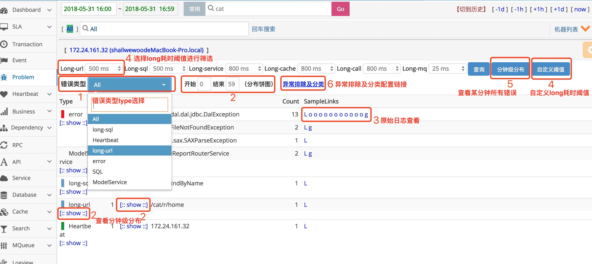
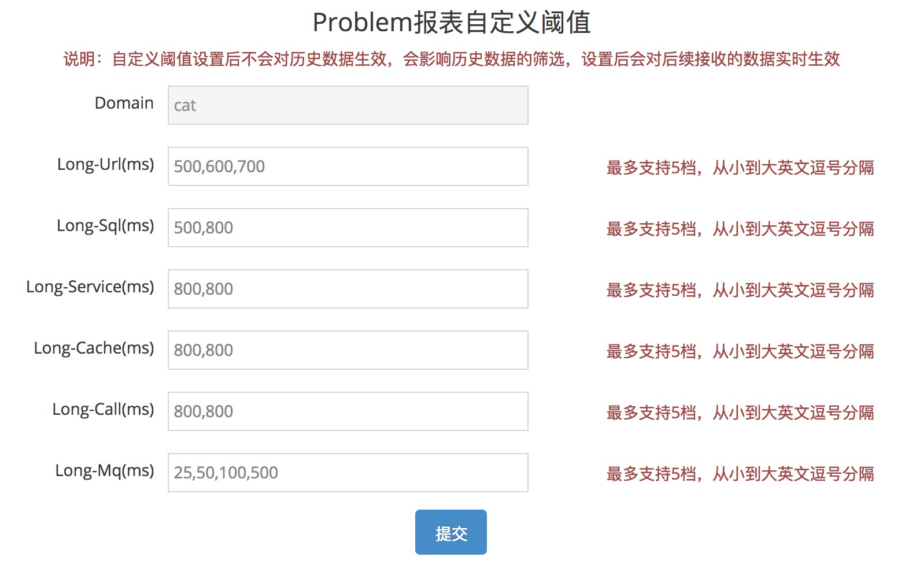

## Problem报表
### 主要功能

Problem记录整个项目在运行过程中出现的问题，包括一些异常、错误、访问较长的行为。Problem报表是由logview存在的特征整合而成，方便用户定位问题。	
来源：		

1. 业务代码显示调用Cat.logError(e) API进行埋点，具体埋点说明可查看埋点文档。
2. 与LOG集成，会捕获log日志中有异常堆栈的exception日志。

###报表介绍
	

1. All为展示所有错误，也可选择某一个错误类型type展示。
2. 点击type和status的show，分别展示type和status的分钟级错误数分布：	
3. 原始日志查看里一般会有出错的整个链路及错误堆栈，这里默认展示60条log。
4. 对于较长耗时，也认为是problem错误，cat已经接入公司绝大多数组件，现支持url、sql等，可以选择不同的耗时阈值。点击“自定义阈值”，可以对耗时阈值分阶段。	
	
5. 分钟级分布可以查看某一分钟的所有错误分布统计

